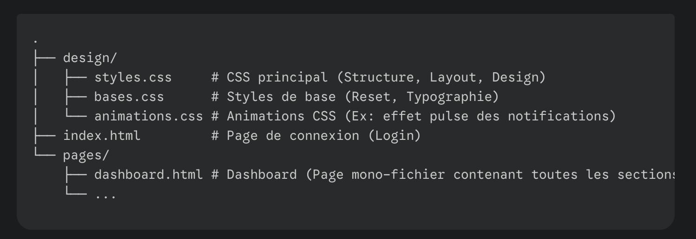

# 🚀 Dashboard Administrateur : Démonstration de Maîtrise HTML & CSS

Ce projet est l'aboutissement de la formation en développement frontal. Il démontre une **maîtrise complète du développement web frontal** à travers la conception et l'implémentation d'une interface de tableau de bord moderne et professionnelle, en se basant exclusivement sur les standards HTML5 et CSS3.

---

## I. 🧱 Maîtrise Technique : HTML & CSS Avancés

Le projet se distingue par l'utilisation stratégique de fonctionnalités CSS avancées, garantissant performance et maintenabilité, sans dépendance à JavaScript pour l'interactivité principale.

### ⚡ Navigation Pure CSS (`:target` et `checkbox`)

* **Gestion des Pages et Modales :** Le changement de contenu (entre les sections `Analytics`, `Commandes`, etc.) et l'affichage des pop-ups (`Mon Profil`, `Détails Commande`) sont gérés via la pseudo-classe `:target` associée aux ancres HTML.
* **Menu Mobile (Off-Canvas) :** Le mécanisme de la barre latérale mobile est implémenté via une `checkbox` cachée (`#sidebarToggle`), permettant un déploiement et une masquage fluides sur les appareils mobiles.

### 📐 Mise en Page Professionnelle (Flexbox & Grid)

* La structure globale du Dashboard (`#dashboard`), ainsi que la mise en page des cartes de renseignement et des sections complexes (Ex: l'évolution des ventes, `#sellEvolution`), exploitent la puissance de **CSS Grid** et **Flexbox** pour un alignement précis et une gestion efficace des composants.

### 🎨 Gestion du Design avec Variables CSS

* Une palette de couleurs complète utilise des **variables CSS** (Ex: `--bleu-side-bar-icon`, `--verts-succes`) pour définir les thèmes, assurant une **maintenance rapide** et une cohérence visuelle sur l'ensemble de l'interface.

---

## II. 🖥️ Conception Moderne et Professionnelle

L'architecture du code et le design de l'interface répondent aux exigences d'un produit professionnel.

### 📱 Design Réactif (*Responsive Design*)

* Grâce aux **Media Queries**, l'interface s'adapte parfaitement aux différentes tailles d'écran (dès `max-width: 1024px`), transformant la barre latérale fixe en un menu *off-canvas* pour une expérience utilisateur optimale sur tablettes et smartphones.

### ⚙️ Architecture Sémantique

* L'utilisation d'un système de classes clair et de balises sémantiques ( `<aside>`, `<main>`, `<header>`, `<nav>`, `<footer>`) garantit une structure HTML propre, accessible et facilement compréhensible.

### ✨ Détails d'Interface

* Implémentation d'un **Switch (Sliding Button)** purement CSS.
* Utilisation d'ombres (`var(--shadow-lg)`) et de transitions subtiles pour ajouter de la profondeur (Ex: effet de survol sur les cartes).

---

## III. 📂 Structure du Projet

## Links
[Github Repo](https://github.com/abbas001900/stockManager.git)  
[Github Page](https://abbas001900.github.io/stockManager/)